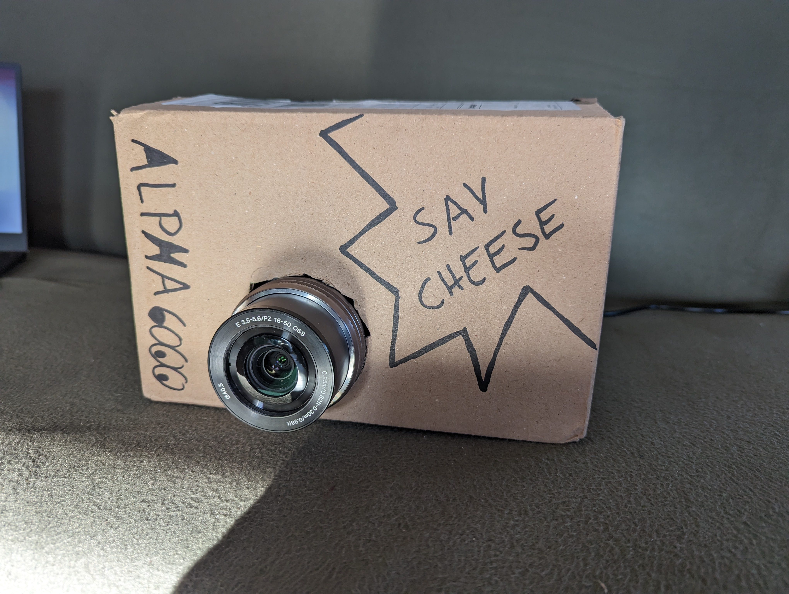

# My Photobooth

This Repository implements a simple Software for your own photobooth. It allows Guests on your next Party to take photos of great memories. The Images are saved on harddrive, can be printed or shared. In a future update I want to implement some filters and collage options too.

## Installation
The GUI is implemented as a QT-Application. The Camera is interfaced via gphoto2. To install needed software run
```./install.sh``` after that you can run the photobox with ```python app.py``` or via the created desktop shortcut.


## Instructions
The User is greeted by a start screen. The Message below the Time can be adjusted to the Event. There is a big Startbutton and two smaller buttons for Collages and Filter options.


If the User presses Start they are redirected to the capture screen, where a countdown is running. There is also a beeping sound so you dont have to look at the screen and get the best results. Be fast and strike your pose. Before the countdown ends.


When the Image is taken there are a few options. From left to right, you can:
* Go back to the start screen
* Delete the last image
* Take another Image
* Share the last Image
* Print the last Image

The Preview is shown for the specified amount of time.


Sharing an Image is a bit complicated. The Software is hosting a small Webserver where all Images are accessible. You have to be in the same network as the device. The QR-Code on the left connects you to the Hotspot of the device, the QR-Code on the right holds the URL of the image.


## Needed Things
### Camera
Here we use an Alpha 6000  
We need an HDMI Capture Card with USB-A to get a live stream. If your camera is newer it may be able to stream as a gphoto2 device via USB-C. Additionally we ened an HDMI to Mini HDMI Cable to connect the capture card.    
For a permanently running System we need a Battery Adapter to USB-A and for Data an USB-Cable (Micro-Usb to USB Type A)

### Computing
Anything running a UNIX-System should work here. A tablet, Laptop, Raspberry Pi. I would recommend Ubuntu 22.04 as OS, because I will describe Installation for that.  
We use an Acer Switch 3 Tablet. But be careful installing Ubuntu on these Things can be hard.

### Printing
Printer: Canon Selphy CP400  
Cable: USB to USB Type-B  
Power Cable

### Additional Hardware
4x USB-Adapter with USB-A  
4x Powerstrip
A box (for a prototype even cardbord is nice)  
Tripod  
Softbox  
Costumes and disguise  
Backgrounds  

Here is a Prototype I build during developement


## Problems

## Tested on:
* Ubuntu 22.04
* Fujifilm XT-3
* Sony Alpha6000